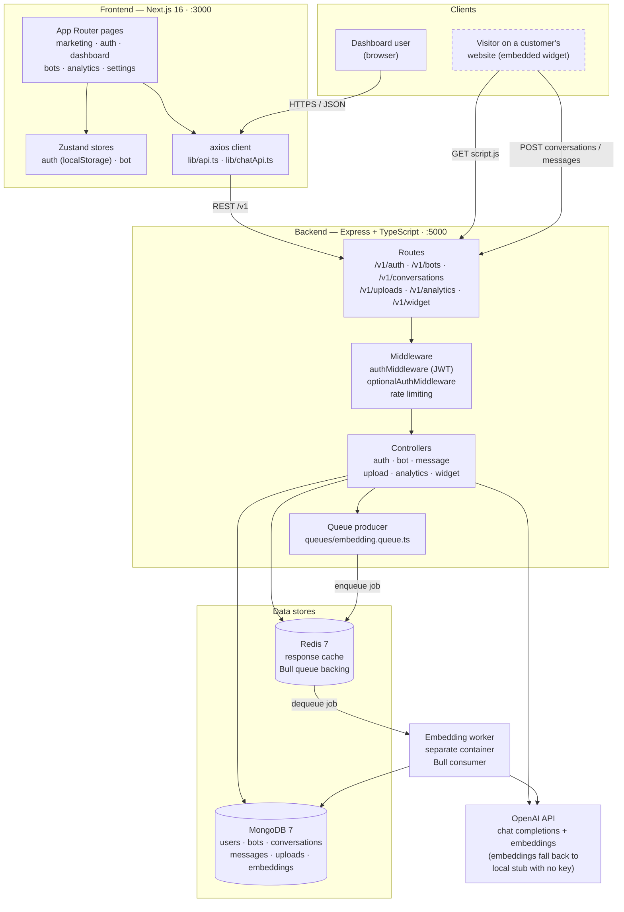
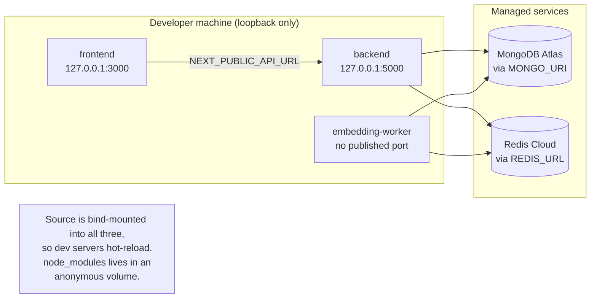
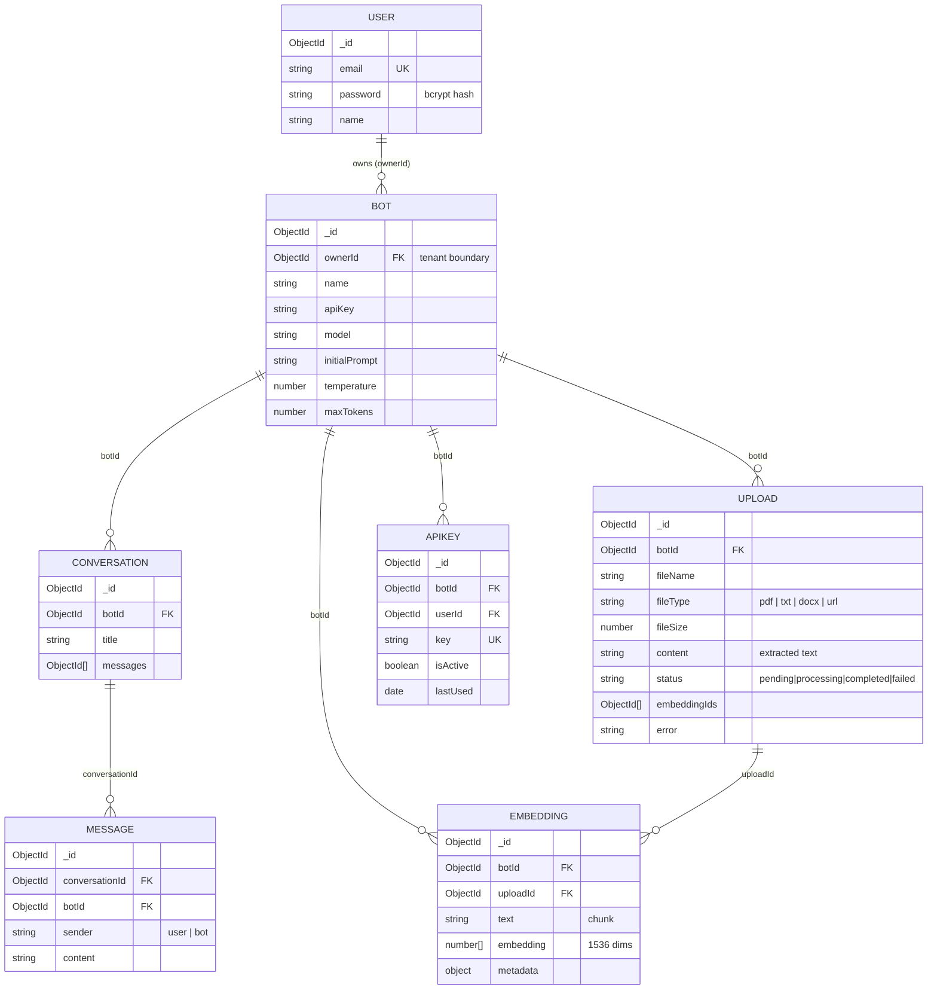
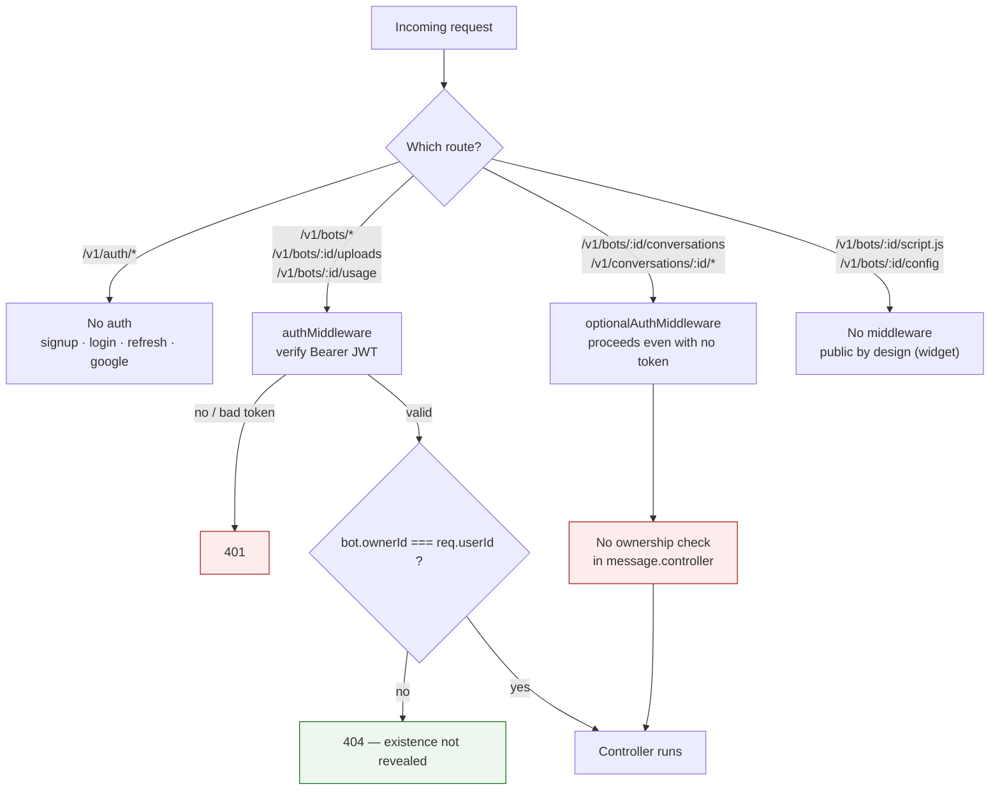
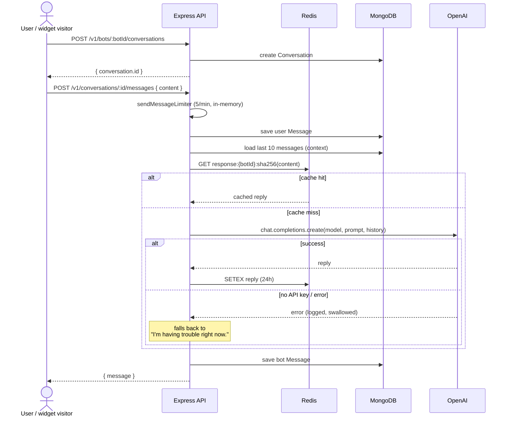
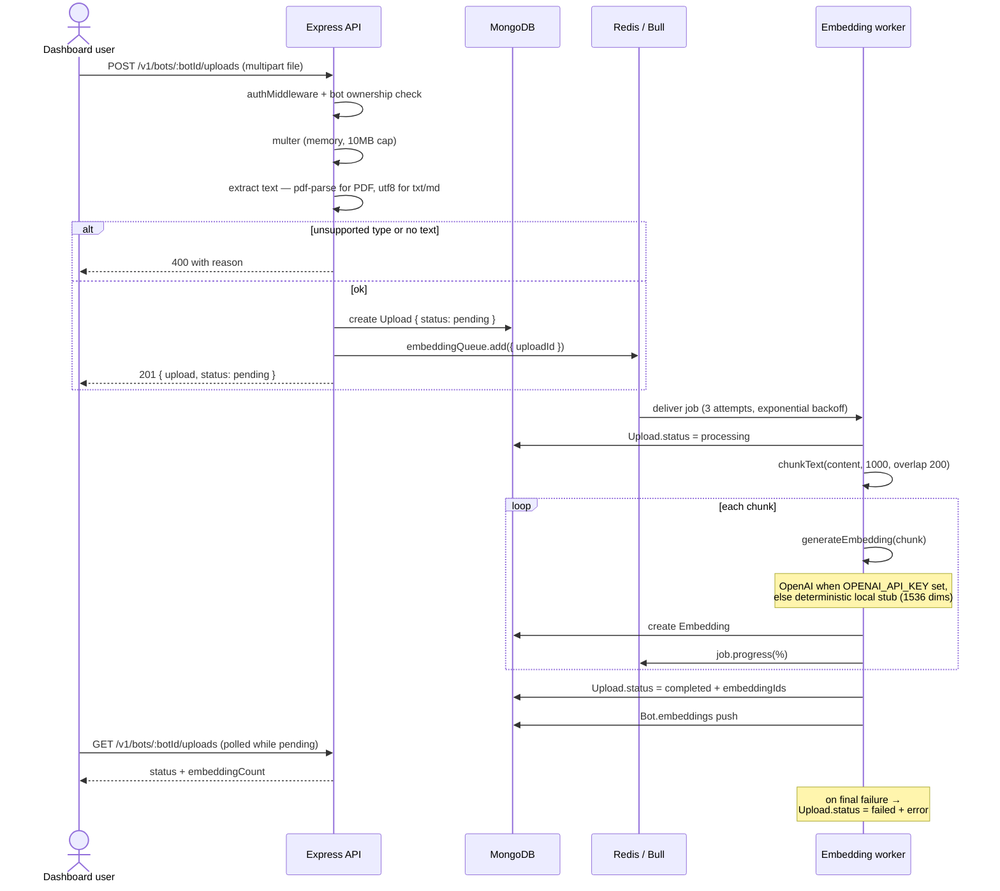
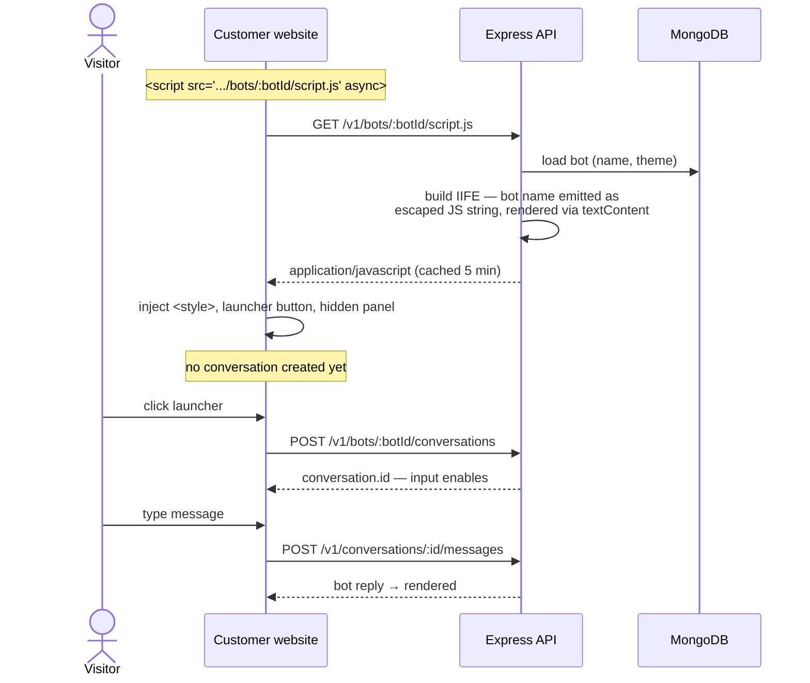
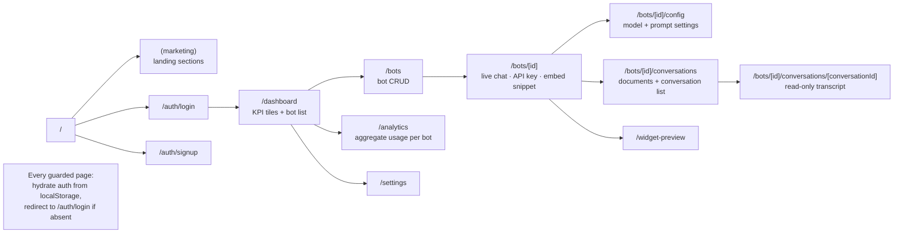

# High-Level Design

AI Chatbot Platform — a multi-tenant service where a user creates bots, uploads
documents to ground them, chats through a dashboard, and embeds a chat widget on
their own website.

All diagrams below describe the system **as built**, including the parts that are
incomplete; those are called out rather than idealised.

---

## 1. System architecture

---

## 2. Deployment topology (Docker Compose)

Three application containers on one bridge network. Both datastores are managed
services, so there are no local database containers and no data volumes.

Because state lives outside Docker, `docker compose down -v` is no longer
destructive, and the containers are disposable.

---

## 3. Data model and tenancy

`Bot.ownerId` is the **only** real tenant boundary. Nothing below `Bot` stores a
`userId`, so authorising any nested resource means loading its bot and comparing
the owner.

---

## 4. Authentication and authorisation

**Verified with two tenants.** Bot CRUD, uploads and analytics isolate correctly
(cross-tenant requests return 404). Conversations and messages do **not**: a
transcript is readable, and a message postable, with no token at all. The
`botAuthMiddleware` and `apiKeyRateLimit` written for per-bot API-key auth exist
but are wired to no route.

---

## 5. Chat request flow

A Redis outage is **not** tolerated on this path: the `cacheGet` call sits
outside the inner try/catch, so a failure surfaces as `500`.

---

## 6. Document ingestion (async queue)

---

## 7. Embeddable widget

The widget is served unauthenticated, so any site that knows a bot id can embed
it and consume the owner's OpenAI quota.

---

## 8. Frontend routes

---

## 9. Known gaps

| Area | Issue |
|---|---|
| Authorisation | `message.controller` has no ownership check; transcripts readable and messages postable with no token |
| Widget auth | `script.js` and message endpoints unauthenticated; `botAuthMiddleware` / `apiKeyRateLimit` unused |
| Redis coupling | Chat path 500s if Redis is unavailable (cache lookup not guarded) |
| Rate limiting | `sendMessageLimiter` uses an in-memory store, so limits are per-process, not global |
| Retrieval | Embeddings are stored and searchable, but chat does **not** retrieve them — replies are not document-grounded |
| Vector search | Cosine similarity computed in Node over the first 100 embeddings; no vector index |
| Analytics worker | `analytics.worker.ts` defines an `analytics` queue that nothing enqueues to |
| Conversation churn | Dashboard bot page creates a conversation on mount, producing empty rows |
